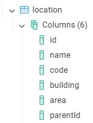
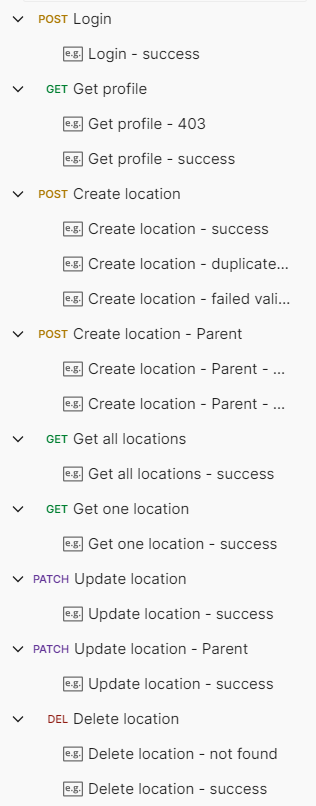
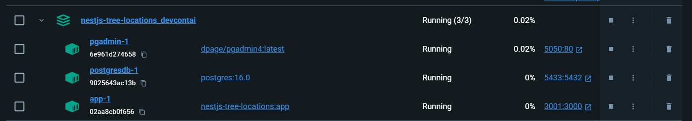

# Project Installation and Running Guide

## Table of Contents
1. [Features](features.md)
2. [System Requirements](#system-requirements)
3. [Clone the Project](#clone-the-project)
4. [Install Dependencies](#install-dependencies)
5. [Configure Environment Variables](#configure-environment-variables)
6. [Setup database](#setup-database)
7. [Running the Project](#running-the-project)
8. [Running the Project using DevContainer (Recommended)](#running-the-project-using-devcontainer-recommended)
9. [Postman](#postman)
10. [Screenshots](#screenshots)
11. [References](#references)

## System Requirements

Before getting started, ensure your system has the following installed:

- **Visual Studio Code** (recommended)

- **Docker desktop** (recommended)

- **Node.js** (version 14.x or higher): Check your Node.js version by running:

  ```bash
  node -v
  ```

- **npm** (comes with Node.js) or yarn: Check your npm version with:
  ```bash
  npm -v
  ```
- **postgres** (version 14.x or higher)

- **Git**: To clone the project from the repository.

## Clone the Project

Clone the project from your repository using the following command:

  ```bash
  git clone https://github.com/phamngoclinh/nestjs-tree-locations.git
  ```

After cloning, navigate into the project directory:

  ```bash
  cd <project-folder>
  ```

## Install Dependencies

Within the project directory, run the following command to install the dependencies:

  ```bash
  npm install
  ```

Or if you are using yarn:

  ```bash
  yarn install
  ```

## Configure Environment Variables

NestJS projects typically use environment variables for configuration. You should create a `.env` file in the root directory of the project or modify the `.env.development` file if provided.

## Setup database

- Create a user (username/password: postgres/postgres)
- Create a database that named "nestjs_tree_locations"


## Running the Project

After installing dependencies and configuring environment variables, you can run the project using:

```bash
npm run start:dev
```

The project will run on the default address: **`http://localhost:3000.`**

## Running the Project using DevContainer (Recommended)

Start Docker desktop

Open source in VSCode

Open source in Container

Wait for finishing setup devcontainer
  - Wait for finishing install npm packages
  - Wait for finishing create devcontainer

Open terminal inside VSCode and run
```bash
npm run start:dev
```

Application will be running on **`http://localhost:3001`**

Pgadmin will be running on **`http://localhost:5050`**
```bash
host = postgresdb
port = 5432
username = postgres
password = postgres
```
**Note**: login by username/password: `myemail@some.com/123456`

## Postman

[Collection file](postman/nestjs-tree-locations.postman_collection.json) for manually setup or quickly setup within document [here](https://documenter.getpostman.com/view/1114930/2sAXjJ6DBh)

**Steps to send request:**

- Step 1. Send `Login` request to get `access_token`
- Step 2. Send any request below

## Screenshots

Database:



Postman:



Docker:




## References
- https://docs.nestjs.com/
- https://typeorm.io/
- https://code.visualstudio.com/docs/devcontainers/containers